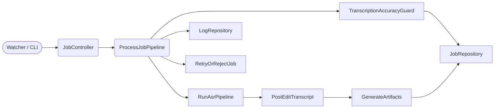

# Representações visuais

Para cumprir o requisito CoCoT/ToT/ReAct, este documento concentra as representações que sintetizam entidades, fluxos e responsabilidades; use-o como referência sempre que alterações tocaram domínios, controllers ou integração visual.

## 1. Diagrama de entidades

```mermaid
classDiagram
    Job --> Artifact : possui
    Job : +id: str
    Job : +profile_id: str
    Job : +status: JobStatus
    Job : +metadata: Dict[str,str]
    Job : +output_paths: Dict[ArtifactType, Path]
    Artifact : +id: str
    Artifact : +artifact_type: ArtifactType
    Artifact : +path: Path
    Artifact : +job_id: str
    TranscriptionResult --> Segment : agrega
    PostEditResult --> Segment : produz
    Segment : +start: float
    Segment : +end: float
```

## 2. Fluxo do pipeline com artefatos visuais



## 3. Mapa de diretórios e módulos

| Área | Responsabilidade | Exemplos |
| --- | --- | --- |
| `src/application` | Orquestração de controllers/serviços | `JobController`, `DeliveryTemplateService`, `Retry` |
| `src/domain` | Entidades + casos de uso e armazéns | `Job`, `ProcessJobPipeline`, `RetryOrRejectJob`, `RunAsrPipeline` |
| `src/interfaces/http` | FastAPI + UI + rotas dos dashboards/templaters | `app.py`, `schemas.py`, `dependencies.py` |
| `src/infrastructure` | Integradores, container, telemetria | `components_*`, `metrics_logger`, `container/service_container.py` |
| `tests/*` | Cobertura: unit, integration, performance | `tests/unit`, `tests/integration`, `tests/performance` |

Use estas representações para validar decisões arquiteturais antes de alterar código crítico e torne-as parte da revisão visual sempre que uma PR tocar em múltiplos domínios.
